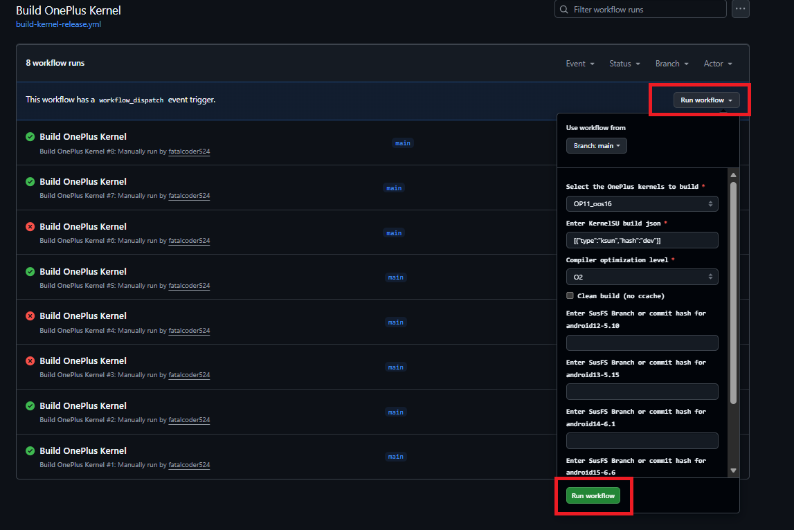

# OnePlus-Remote-Action-Build
Build OnePlus latest kernel for your device with KSUN/WildKSU/KSU + SusFS anytime without knowing or self-patching. Just clone, edit config as per requirement and build.

## How to Start?
1. Click on Fork button.

2. Clone all branches!

3. Voila. All Done here :-)
4. Then clone the repo to your local system. [Optional if you want fine control]

## How to edit configs?
1. Change Branch from main to devices.

  

2. Edit the config for your device using web edit option.

Note: Not gonna explain for cloned user as you already have some idea on how to use git or use AI to learn.

## How to Build Kernel now that everything is setup?
1. Click on Actions Tab.
2. Accept the Enable Workflow Caution message from GitHub.

3. Click "Build OnePlus Kernel" under All Workflows

  

4. Click Run Workflow to get build options. Click Second Run Workflow button to build.

## How and What to configure in Build Options?
1. **Branch**: Always keep it main.
2. **Select the OnePlus kernels to build**: Select your device and OOS/COS version. Eg: OP11_oos16
3. **Enter KernelSU build json**: This input needs a valid single line json. Eg: `[{"type":"ksun","hash":"dev"}]`
	a. **type**: Valid options are :- `ksun` and `ksu`
	b. **hash**: This is the branch name or commit hash of selected KSU variant you want to build. Some valid values are:
		i.   `[{"type":"ksun","hash":"dev"}]`
		ii.  `[{"type":"ksu","hash":"main"}]`
		iii. `[{"type":"ksun","hash":"8de61e2305d02b927f32c41b91c05437c8a92425"}]`
4. **Compiler optimization level**: Valid options are `O2` and `O3`. Recomended to always use `O2`.
5. **Clean build (no ccache)**: Enabling this builds without previous caches. First build is always clean and take a long time. Subsequent builds are faster when cache is used. If a cache is not used for a long time, the cache is invalidated and will be considered a fresh build.

Below Options all have same properties:

6. **Enter SusFS Branch or commit hash for android12-5.10**: SusFS hash for android12-5.10

7. **Enter SusFS Branch or commit hash for android13-5.15**: SusFS hash for android13-5.15

8. **Enter SusFS Branch or commit hash for android14-6.1**: SusFS hash for android14-6.1

9. **Enter SusFS Branch or commit hash for android15-6.6**: SusFS hash for android15-6.6

10.**Enter SusFS Branch or commit hash for android16-6.12**: SusFS hash for android16-6.12

	a. Leave blank for latest.
	b. Take hash from SusFS repo and correct branch based on your kernel.
	c. You need to fill hash only for your kernel version if you need a particular version. 

## FAQs
### 1. Why are the builds failing?
Builds can fail for various reasons:
1. Fix Patches developed for KSUN + SusFS might be outdated.
2. SusFS might not be in sync with latest KSUN or KSU.
3. KSUN might not be in sync with latest SusFS.
4. Issue in remote build logic during maintainance or update.

### 2. What should I do if builds are failing?
1. Wait for Fix Patches to get updated if KSUN + SusFS build is failing.
2. Wait for All Projects [SusFS, KSUN, KSU, Remote build(WildKernels OnePlus Repo)] to get update.
3. Check if both branches are in sync with upstream action build.
4. Build with old working hashes. [You can ask for build hashes in WildKernels TG group]

### 3. How often is fix patches updated?
1. Depending on how important the changes are:
	1. 1-3 days if new detection fixes are added.
	2. If unimportant and standard fixes, then 1 week to 2 weeks.

### 4. I'm a pro dev. I can build my own patches. Why should I clone this repo and use this?
You can clone my OnePlus build repo or Wild Kernels repo and do the necessary changes there and then point remote action build to your own fork so that you can build for your changes and your devices only. This repo should help you build and test your patches before PRs.

### 5. How do I know if my device is supported?
Check the devices branch for list of devices and supported OOS/COS version.

### 6. It says OOS everywhere. Does that mean COS is not supported?
Nope. COS is supported. Its just a naming scheme used. COS and OOS both use same kernel. If there is any difference, it is denoted using model numbers like `PJZ` or `CPH`.

### 7. I have Realme Device. Can I use the action build to build kernels?
Check the compatibity list at Wild Kernels. You can build and test the kernel yourself and report us at WildKernels if its working for you, so that we can update the list.